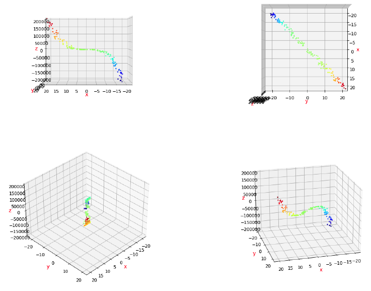
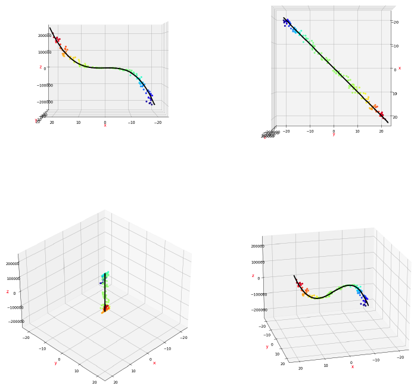
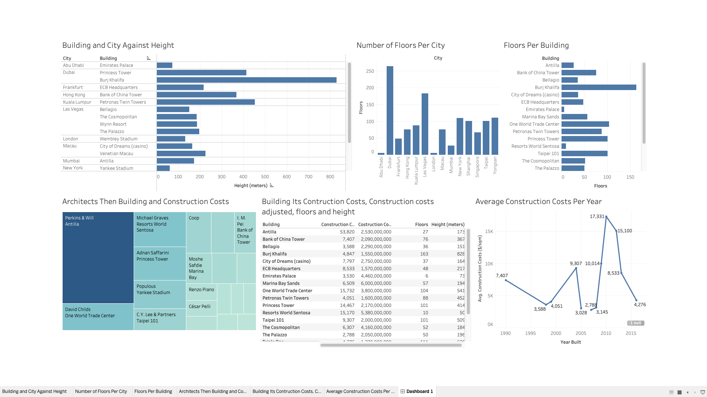
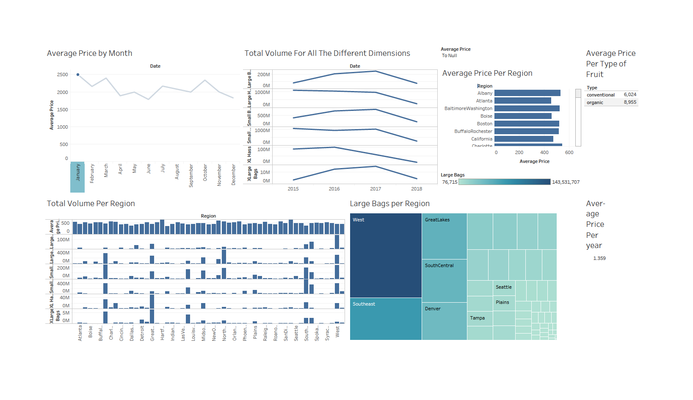
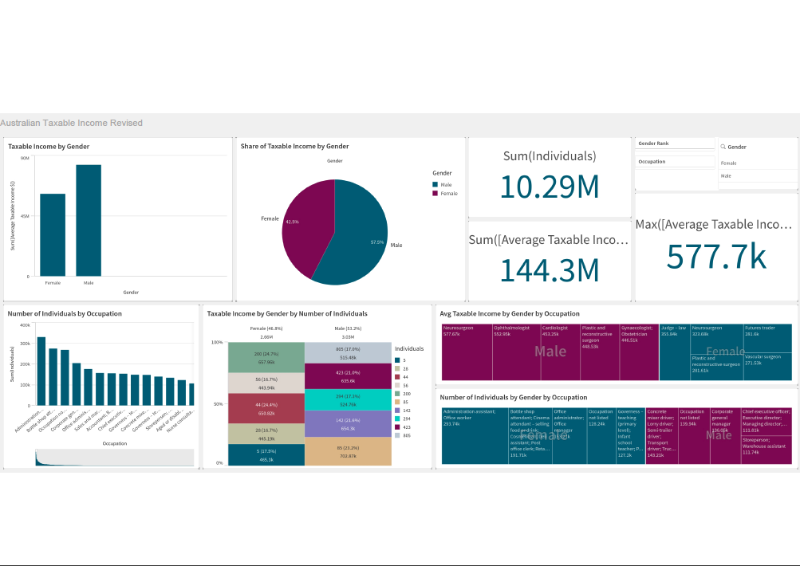

# Erin_Portfolio
Data Science Portfolio

# [Project 1: Mushroom Classifier: Project Overview](https://github.com/moore3229/Mushroom-Classifier)
I will be investigating the K Nearest Neighbors and PCA algorithms using sklearn's KNeighborsClassifier and PCA class. I will use a RandomForestClassifier and a Logistic Regression to predict whether or not a mushroom is edible based on the mushroom dataset. The KNN algorithm will be used to fill in missing values in our dataset and the PCA algorithm will be used to reduce the dimensionality of the data. The goal is to evaluate the effect of dimensionality reduction on two common models and to gain experience with the KNN algorithm with respect to imputation. This Notebook is broken down into 7 sections:
1). Import Data
- Simply importing .csv containing the mushroom dataset
2. Investigate and Fix Data
- Print out data and fill in any missing values using KNN algorithm
3. Train on Full Dataset
- Encode the full dataset, train the RandomForestClassifier and Logistic Regression, and comment on training time
4. Evaluate Performance on Full Dataset
- Calculate accuracy, precision, and recall scores for each model and comment on results
5. Reduce Dimensionality
- Apply PCA reduction to full dataset, display old and new dimensions and reduction percentage
6. Train on Reduced Dataset
- Retrain RandomForestClassifier and Logistic Regression on reduced dataset and comment on training times
7. Compare Performance
- Tabulate RandomForestClassifier and Logistic Regression performance data for both datasets and comment on results

Conclusion:
Based on the table above, the models perform worse with the reduced dataset, however the drop in performance is greatly outweighed by the drop in dimensions. This means even with a logistic regression, which is a fairly simple model, we can expect decent results with much less training time. However, the RandomForestClassifier takes longer to train on the reduced dataset because there are fewer ways in which the data can be split. Even so, the RandomForestClassifier performs very well - greatly outperforming the logistic regression on the reduced dataset in both accuracy and precision, but losing slightly in recall. This means the RandomForestClassifier is more likely to get the correct prediction and less likely to have false positives (in this case falsely identifying a poisonous mushroom as edible). But, the RandomForestClassifier is less likely to get all edible mushrooms (falsely labels as poisonous). So, overall, the RandomForestClassifier performs better on the reduced data, especially because the logistic regression is much more likely to say a poisonous mushroom is edible. I would also conclude that using the logistic regression on the full dataset is the best option because it did not miss any mushroom labels and had a lower training time compared to the RandomForestClassifier.

# [Project 2: Covid-19 Database: Project Overview](https://github.com/moore3229/Covid-19-Database)

Our goal is to investigate Covid-19 data obtained from AWS to better understand the virus's economic and socioeconomic effects. The data gave by AWS' "Covid-19 Harmonized Dataset" is quite detailed, and it comes from "The Covid Tracking Project." As of March 7th, 2021, “The Covid Tracking Research” will stop collecting new data, which will not affect our project. Researchers, doctors, non-profits, educational institutions, students, and government organizations will all benefit from this database. These are the people that are involved in our project. We plan to build the database specifically to address queries about population density and covid-19 instances.

This project will help with research efforts among, public entities, private entities, and startups. The python app we will develop will be simple. We will use our python app to connect to the database, read and display select data, update specific data, and get state, population, and average daily hospitalization by the state in descending order of hospitalization rate. Our efforts intend to attempt to answer the question:

How does state population density relate to the spread of the disease (a measure of the effectiveness of social distancing). Texas has nearly 20 million more residents than Michigan – and yet – Texas has a lower rate of positive cases than Michigan. Why? Is it due to Michigan having a higher number of elderly residents or due to increase poverty?

Conclusion: We were able to gain insights, but due to the quality of the data we were not able to answer the specific questions we had as it pertained to the correlation of positive cases, death(s), age, employment, and poverty. However – we were able to determine that there is a weak correlation between population density and positive covid cases. We used the following:

SELECT (AVG(POSITIVE * POP_DENSITY) - AVG(POSITIVE) * AVG(POP_DENSITY)) / (SQRT(AVG(POSITIVE * POSITIVE) - AVG(POSITIVE) * AVG(POSITIVE)) * SQRT(AVG(POP_DENSITY * POP_DENSITY) - AVG(POP_DENSITY) * AVG(POP_DENSITY))) AS CORRELATION_COEFFICIENT_POPULATION FROM C19_TRK_US_STATES_DAILY D INNER JOIN C19_TRK_US_POPULATION_STATES P ON D.STATE = P.STATE WHERE DATE = '2020-03-15 00:00:00';

Due to the relatively low correlation coefficient – the increase in positive cases may have more to do with low engagement in preventative measures – such as masks, social distancing, and handwashing – than population density.

# [Project 3: Polynomial Regression: Project Overview](https://github.com/moore3229/Polynomial-Regression)

Polynomial Regression Problem

- Created the following figure using matplotlib, which plots the data from the file called PolynomialRegressionData_II.csv
- Performed a PolynomialFeatures transformation, then perform linear regression to calculate theoptimal ordinary least squares regression model parameters.
- Recreated the first figure by adding the best fit curve to all subplots.
- Infered the true model parameters.

# [Project 4: Tree-Based Regression Methods ](https://github.com/moore3229/Tree-Based-Regression-Methods)

In this project I explored the GradientBoostingRegressor, RandomforestRegressor, and DecisionTreeRegressor to fit my data. 

- Performed Grid Searches
  Performed grid searches to elucidate the optimal model hyperparameters and additional rounds to tune-in on the correct values.
- Visualized Optimal Model Predictions for all three models
  Visualized each model's predictions for the training data.
- Computed Generalization Error(s)
  Computed the generalization Error for all three models. 

Analysis on the different algorithms:

- The GradientBoostingRegressor works by combining the predictive power of many machine learning models in an ensemble approach to more accurately predict future data and, in sklearn, the underlying models are decision tree regressors. In gradient boosting, each successive model is tuned to better predict where the previous one(s) failed. It does this by fitting the next regression tree to the negative gradient of the loss function of the previous ensemble. This means each successive tree is trained to minimize the loss function of the next ensemble when it is incorporated. In plain language, this means that each new model is specifically trained to best fit the data points that the previous ensemble predicted the worst. The RandomForestRegressor works similarly to the GradientBoostingRegressor, except it does not optimize each successive model. Instead, some number of models are created independently and their results are amalgamated at the end. The DecisionTreeRegressor works by continuously splitting the input data into subsets. It then analyzes each subset to find which subset best explains the target values and picks that subset (called a node in a tree). The regressor continues splitting the chosen subsets until certain hyperparameters are met, such as maximum depth where the depth is how many times a subset is split and analyzed.

- The RandomForestRegressor performs the best, followed by the DecisionTreeRegressor, and then the GradientBoostingRegressor.

- We expect the GradientBoostingRegressor to perform the best because each successive model is tuned specifically to optimize the next result, whereas the RandomForestRegressor creates many independent models and the DecisionTreeRegressor is just one model. Surprisingly, the RandomForestRegressor outperforms the GradientBoostingRegressor, which also barely underperforms versus the DecisionTreeRegressor. This may be because our grid search optimized the GradientBoostingRegressor to have 1250 successive models but only at a depth of 1, so they may have overfit.

- For the RandomForestRegressor plot, we see many more minute adjustments in the regression line, whereas the GradientBoostingRegressor and the DecisionTreeRegressor produced much blockier curves. This means that the RandomForestRegressor better fit the data and was more sensitive to small deviations in the data. I suspect that this is a result of the larger optimal depth of the RandomForestRegressor (8) compared to that of the GradientBoostingRegressor (1) or the DecisionTreeRegressor (6). I also suspect that if we were to force the GradientBoostingRegressor to have a larger maximum depth that it would perform slightly better.

Model Selection:

Based on the available evidence, I would recommend the RandomForestRegressor with hyperparameters of: max_depth = 8, n_estimators = 900, min_samples_split = 8. I would also recommend that further investigation be done as to why the GradientBoostingRegressor did not perform the best, since in theory it should. Perhaps the type of data we are investiging contributed to this surprising result.

# [Project 5: Data Visualization - Tableau 1: Project Overview](https://github.com/moore3229/Data-Visualization---Tableau-1)

- Built a bar chart showing Building and City against Height.
- Built a bar chart showing Number of floors per City
- Built a chart showing Floors per Building
- Built a treemap grouping Architects then Building and then Construction Costs.
- Built a table showing the building its construction costs,Constructions costs adjusted, floors and height.
- Built a line chart showing average construction costs per year.

# [Project 6: Data Visualization - Tableau 2: Project Overview](https://github.com/moore3229/Data-Visualization---Tableau-2)

- Built a timeline showing the Average Price by Month.
- Built a timeline showing the total volume for all the different dimensions except Average Price, each in its separate graph.
- Built a bar chart showing the Average Price per Region
- Built a series of bar charts showing Total volume per region, each in its separate chart.
- Built a treemap showing the total number of Large Bags per Region
- Built a small table showing the Average Price per Type of Fruit.
- Built a small table showing Average Price per Year.

# [Project 7: Data Visualization - Qlik Sense 1: Project Overview](https://github.com/moore3229/Data_Visualization_Qlik_Sense_1)

- Built a Bar chart segregating Taxable Income by Gender
- Built a Pie Chart Showing the Share of Taxable Income by Gender
- Built a KPI showing the number of individuals.
- Built a KPI showing the Avg Taxable Income.
- Built a filter for Gender Rank, Occupation, and Gender.
- Built a bar chart showing the number of individuals by occupation.
- Built a Mekko Chart showing the Taxable income by Gender by Number of Individuals (showing only the top 5,
does not show Others).
- Built a Tree Map showing the Average Taxable Income by Gender by Occupation (showing only the top 5, does
not show others).

